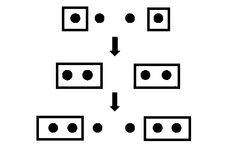
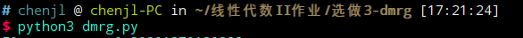
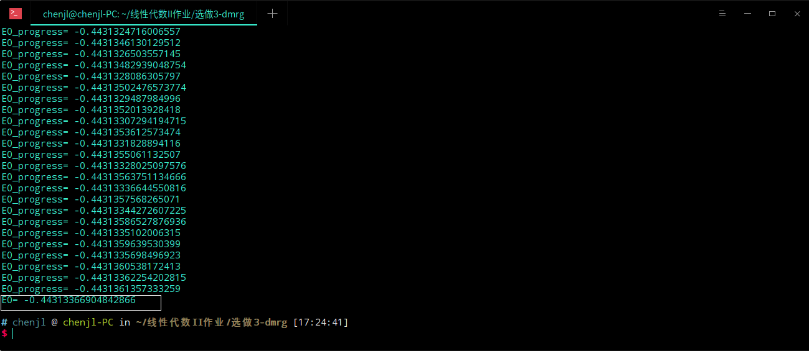

# DMRG计算无限长自旋1/2反铁磁Heisenberg模型基态能量

## 一、算法介绍

DMRG是Steven R. White在1992提出的一种数值算法，可以用来计算量子多体系统。DMRG算法把整个体系分为两个部分：一部分是系统，另一部分是环境，而系统和环境的整体称为超块。通过超块的基态我们可以构造体系的约化密度矩阵，DMRG认为这些拥有较大本征值的本征态是基态中最重要的态，以此为标准对系统部分做重整化。

DMRG算法的过程可以用一张图表示如下[1]：



具体来讲，就是每进行完一次重整化处理后，在系统和环境分别增加一个点，然后接着重整化。

对于一维无限长系统，DMRG算法伪代码描述如下[1]：

1. 从一个小尺寸超块开始：一般包括四个格点，两个构成系统，两个构成环境；
2. 将系统(环境)块的$H^s(H^e)$及相关算符写成矩阵；
3. 构造超块哈密顿量$H^{super}$,对角化该矩阵，得到基态波函数$\psi_{ij}$;
4. 由波函数$\psi_{i,j}$构造系统（环境）块约化密度矩阵$\rho^s_{ii'}=\sum_j\psi_{ij}\psi_{i'j}$（$\rho^e_{jj'}=\sum_i\psi_{ij}\psi_{ij'}$）;
5. 对角化约化密度矩阵，保留m个本征值最大的本征函数$\bar{U}^s(\bar{U}^e)$;
6. 在新的基矢中将$H^s(H^e)$即相关算符$O$表示出来:$\bar{A}=\bar{U}^\dagger A \bar{U}$;
7. 在系统块和环境块中间插入两个点，构造新的系统块和环境块；
8. 转到2继续循环，至结果收敛

## 二、具体实现

### 2.1 主要代码

```python
for i in range(looptime):
	#gen real initial vector for lanczos to start
    v0=np.random.random(np.shape(Hsuper)[0]);v0/=np.sqrt(np.linalg.norm(v0)) 
    # get the smallest eigenvalue and eigenvector by lanczos
    w,phi0=eigsh(Hsuper,k=1,v0=v0) 
    E_0=(w[0]-lastE)/2
    lastE=w[0]
    # print("E0_progress=",E_0)
    # reshape \phi_0 from vector to matrix.
    phi0=np.reshape(phi0,(int(np.sqrt(phi0.shape[0])),-1))
    
    #----------------------------------------------
    
    # construct density matrix
    
    ## construct density matrix for the system
    rhoSys=np.tensordot(phi0,np.conj(phi0),(1,1)) #视为二阶张量的写法
    # rhoSys=phi0@np.conj(np.transpose(phi0)) #当做矩阵的写法
    w,USys=np.linalg.eigh(-rhoSys) # - rhoSys,to get eigenvalue in the inverse order.
    USys=USys[:,0:truncatureNum]

    ## construct density matrix for the environment
    rhoEnv=np.tensordot(np.conj(phi0),phi0,(0,0))
    # rhoEnv=np.conj(np.transpose(phi0))@phi0
    w,UEnv=np.linalg.eigh(-rhoEnv)
    UEnv=UEnv[:,0:truncatureNum]

    #----------------------------------------------
    
    # construct related operator in the new base
    nowI=np.identity(int(np.shape(phi0)[0]/2))
    
    ## System (new)
    SxNow=np.kron(nowI,Sx)
    SyNow=np.kron(nowI,Sy)
    SzNow=np.kron(nowI,Sz)
    SInnerEdgeSnew=np.kron(transformBase(USys,SxNow),Sx)+\
                   np.kron(transformBase(USys,SyNow),Sy)+\
                   np.kron(transformBase(USys,SzNow),Sz)
    HSys=np.kron(transformBase(USys,HSys),np.identity(2))+SInnerEdgeSnew

    ## Env (new)
    SxNow = np.kron(Sx,nowI)
    SyNow = np.kron(Sy,nowI)
    SzNow = np.kron(Sz,nowI)
    SInnerEdgeSnew=np.kron(Sx,transformBase(UEnv,SxNow))+\
                   np.kron(Sy,transformBase(UEnv,SyNow))+\
                   np.kron(Sz,transformBase(UEnv,SzNow))
    HEnv=np.kron(np.identity(2),transformBase(UEnv,HEnv))+SInnerEdgeSnew

    ##super (new)
    baseNum=np.shape(HEnv)[0]
    Hsuper=np.kron(HSys,np.identity(baseNum))+\     np.kron(np.identity(int(baseNum/2)),np.kron(basicCell,np.identity(int(baseNum/2))))+\np.kron(np.identity(baseNum),HEnv)
```

### 2.2 要点备注

### 2.2.1 将波函数从向量转为矩阵

设系统的基底为$|s_1>、|s_2>、...|s_n>$，环境的基底是$|e_1>、|e_2>、...|e_n>$,那么；系统和环境直积之后，超块的基底为：
$$
(|s_1>,|s_2>...)\otimes(|e_1>,|e_2>...)\\
=(|s_1e_1>,|s_1e_2>,...|s_1e_n>,|s_2e_1>,...|s_2,e_n>...)\\
$$
就是说，我们最后得到的波函数相当于是在内存里行优先储存的波函数，怎么将其转化为矩阵形式就很清楚了。在python-numpy中，我们通过`phi0=np.reshape(phi0,(int(np.sqrt(phi0.shape[0])),-1))`便可将其转化为矩阵。

其中`int(np.sqrt(phi0.shape[0]))`是利用方阵的性质计算该方阵的行数/列数；`-1`则可以算是一种语法糖的存在，意思是自动计算列数。

### 2.2.2 基态能量的估计

我刚开始估算基态能量用的是整体能量直接对格点数取平均，但是最后的结果精度并不算很高，远低于Steven R. White在其论文中给出的精度。后来仔细看了他的论文，发现他估算基态能量的方法是每一次能量与上一次能量做差再取两个格点的平均，原文如下[2]：

>The energy per site was determined from the difference in total energy of the system A··A from one iteration to the next. 

改用这种方法之后，程序的运行结果确实可观了不少，可以达到差不多的精度。

## 三、运行结果

**调用方式**



**最终结果**

参数：截断数目30，循环次数100次（即系统环境各加100个点）

测试环境：deepin 15.11 桌面版



从图中可以见得，最终的能量$E_{0-dmrg}\approx-0.443134$,与理论值$E_0=-ln2+0.5\approx-0.4431472$相比误差在$1e^{-5}$，可以接受。

## 参考资料

[1] 线性代数II群中dmrg的ppt.

[2] White, & R., Steven. (1992). White, S.R.: Density matrix formulation for quantum renormalization groups. Phys. Rev. Lett. 69, 2863-2866. Phys. Rev. Lett.. 69. 2863-. 10.1103/PhysRevLett.69.2863. 